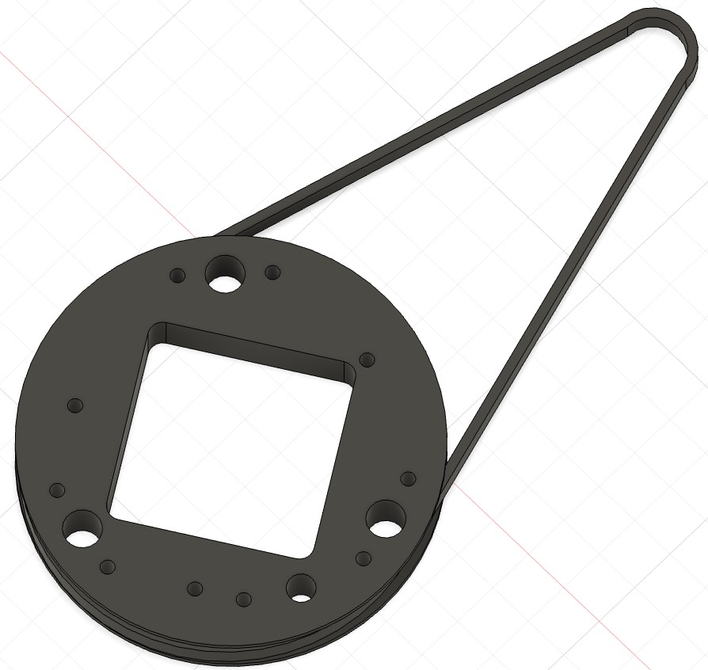
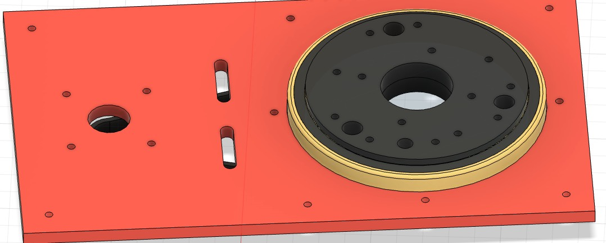
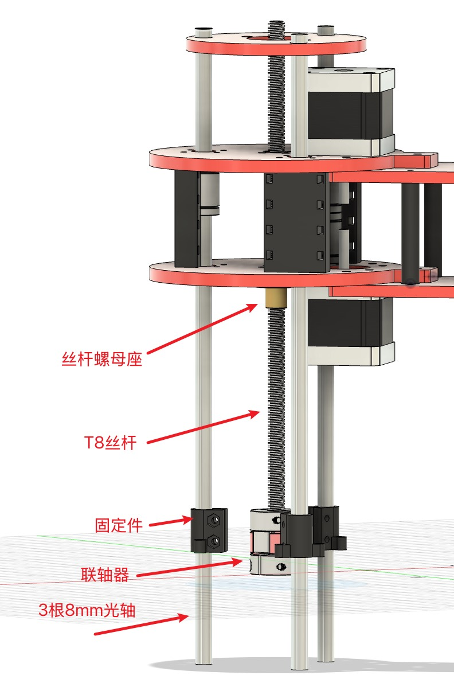
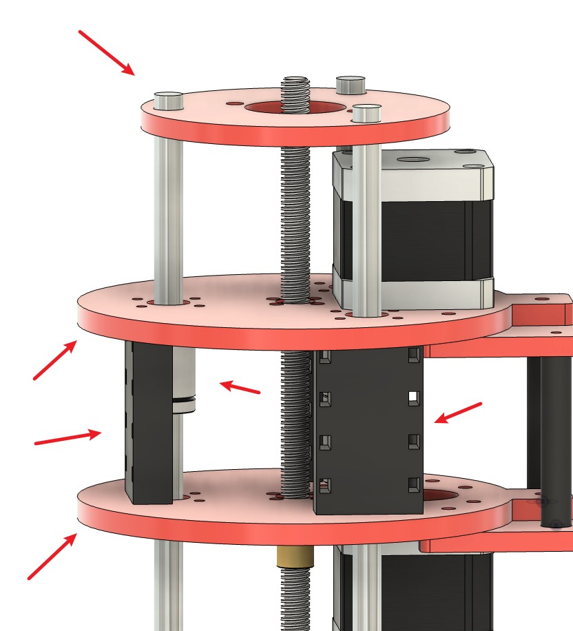

# Assembly_Final v4 (Root Assembly)
共有4个模块：
- Base
- Shoulder 肩
- Forearm 小臂
- Gripper 抓手

# Base

## Openbox
这是机械臂底座盒子，里面包含了2个NEMA17电机，一个电机控制Z轴，一个电机通过gt2_20t-sh8轴连接到Floor BaseGT2 Timing Pulley, 控制A轴.
- 2个NEMA17电机
- 1个gt2_20t-sh8轴
- 1个belt
- top 面板 -> 3d打印件
- bottom 面板 -> 3d打印件
- slide 面板 x2 -> 3d打印件
- front 面板 -> 3d打印件
- back 面板 -> 3d打印件

## 同步轮(timing pulley)模块
openbox的一个电机通过gt2_20t-sh8轴连接到Floor BaseGT2 Timing Pulley.这就是A轴，带动整个大臂旋转。

中间正方形的位置，是给openbox中另一个电机的，直接插入，这是z轴。
- gt2_20_timing_pulley -> 3d打印件

## 轴承模块
主要是围绕轴承61816-2RS1展开的，与openbox里面的一个电机，达成控制A轴的任务。Floor BaseGT2 Timing Pulley通过螺丝与该模块连接。61816-2RS1里面套了两个3d打印件，都叫 Hosinginner,外面套了一个3d打印件，叫 HousingOuterStdmountHoles ，主要目的我认为是把整个模块包装起来了。整个轴承模块直接放到了openbox的top上面。

- bearing -> 61816-2RS1,轴承 -> 购买件
- Hosinginner 1 -> 3d打印件
- Hosinginner 2 -> 3d打印件
- HousingOuterStdmountHoles -> 3d打印件

注：Hosinginner 2 是61816-2RS1的内层，Hosinginner 1 是61816-2RS1的外层。

## z轴模块
这个模块是基于轴承模块的，有3根8mm光轴，直接插在Hosinginner 1 上面。中间是一根lead screw，用来连接z轴电机，是T8 丝杆。当然T8丝杆还需要一个trapezoidal lead screw nut，T8螺母座。T8丝杆通过一个L30xD25 CouplerASM 8to8与openbox中的电机相连，这里有可能是标注错误，可能是5mm转8mm的。

- 1个T8 丝杆 -> 购买件
- 1个T8 螺母座 -> 购买件
- 1个L30xD25 CouplerASM 8to8,联轴器 -> 购买件
- 3个8mm 光轴 -> 购买件
- 3个smooth rod 30mm -> 3D打印件

## shoulder
这个shoulder是我自己定义的，

最顶上是topclamp，起到稳固作用，然后是两个一样的圆形配件，用来连接大臂的，叫shoulderBase，然后是6个LM8UU，直线轴承，外面包裹了一个3d打印件用于固定，原作者是用扎带绑起来了。上下各有一个电机，控制小臂和夹爪旋转。

- 6个LM8UU,直线轴承 -> 购买件
- 2个shoulderBase -> 3d打印件
- 1个topclamp -> 3d打印件

- Base

    - Motors:1
      - Motors
        - NEMA_17_Wantai609 v1:1
          - NEMA_17_Wantai609 v1
            - Wantai609:1
              - Wantai609
        - NEMA_17_Wantai609 v1:2
          - NEMA_17_Wantai609 v1.001
            - Wantai609:1.001
              - Wantai609.001
    - Bearing Housing 80
        - HousingInner
        - HousingOuterStdmountHoles
    - Bearings
        - ID80_61816-2RS1
            - SKFBearing80
    - Clamps
        - SmoothRod_Clamp v1:1
        - SmoothRod_Clamp v1:2
        - SmoothRod_Clamp v1:3
    - Floor BaseGT2 Timing Pulley v2 v1:1
      - Floor BaseGT2 Timing Pulley v2 v1
    - GT2_20T-sh8 v1:1
      - GT2_20T-sh8 v1
    - GT2_20T-sh8 v1:2
      - GT2_20T-sh8 v1.001
    - GT2_20T-sh8 v1:3
      - GT2_20T-sh8 v1.002
    - Guide Rails:1
      - Guide Rails
        - 300mm Smooth Rod v1:1
          - 300mm Smooth Rod v1
        - 300mm Smooth Rod v1:2
          - 300mm Smooth Rod v1.001
        - 300mm Smooth Rod v1:3
          - 300mm Smooth Rod v1.002
    - L30xD25 CouplerASM 8to8 v1:1
      - L30xD25 CouplerASM 8to8 v1
        - Coupler_A:1
          - Coupler_A
        - Coupler_B:1
          - Coupler_B
        - Dampener:1
          - Dampener
        - M3x12_Screw:1
          - M3x12_Screw
        - M3x12_Screw:2
          - M3x12_Screw.001
    - Lead screw 300 v1:1
      - Lead screw 300 v1
    - Micro Switch v1:1
      - Micro Switch v1
    - MotorBaseBox v1:1
      - MotorBaseBox v1
        - OpenBox:1
          - OpenBox
            - Back:1
              - Back
            - Bottom:1
              - Bottom
            - Front:1
              - Front
            - Side1:1
              - Side1
            - Side2:1
              - Side2
            - Top:1
              - Top

    - SmoothRod_Extra_Long_Clamp v1:1
      - SmoothRod_Extra_Long_Clamp v1
        - Limit Switch Panel:1
          - Limit Switch Panel
    - TopClamp:1
      - TopClamp
    - Trapezoidal lead screw Nut tr8x8-4 v1:1
      - Trapezoidal lead screw Nut tr8x8-4 v1
    - ZEndStopClamp v1:1
      - ZEndStopClamp v1
        - EndStopClamp:1
          - EndStopClamp
        - Micro Switch v1:1.001
          - Micro Switch v1.001
- Belts:1
  - Belts
    - A_Belt:1
      - A_Belt
    - C_Belt_1:1
      - C_Belt_1
    - C_Belt_1:2
      - C_Belt_1.001
    - C_Belt_2:1
      - C_Belt_2
- Forearm:1
  - Forearm
    - BearingHousingPassthrough30 v10:1
      - BearingHousingPassthrough30 v10
        - inner_housing:1.003
          - inner_housing.006
        - inner_housing:2.003
          - inner_housing.007
        - outer_housing:1.002
          - outer_housing.002
    - BearingHousingPassthrough30 v1:5
      - BearingHousingPassthrough30 v1.003
        - inner_housing:1.004
          - inner_housing.008
        - inner_housing:2.004
          - inner_housing.009
        - outer_housing:1.003
          - outer_housing.003
    - Bearings (2):1
      - Bearings (2)
        - ID30_61806-2RS1 v1:3
          - ID30_61806-2RS1 v1.003
            - SKFBearing30:1.003
              - SKFBearing30.003
    - Forearm v40:1
      - Forearm v40
        - LowerForearm2_outside_bearing_0,5:1
          - LowerForearm2_outside_bearing_0,5
        - UpperForearm2:1
          - UpperForearm2
    - GT2 Timing Pulley Hole Conn v1:2
      - GT2 Timing Pulley Hole Conn v1.002
    - GT2 Timing Pulley Hole Conn v1:3
      - GT2 Timing Pulley Hole Conn v1.001
    - Micro Switch v1:2
      - Micro Switch v1.002
    - Standoffs:1
      - Standoffs
        - standoff_30 v1:1
          - standoff_30 v1
        - standoff_30 v1:2
          - standoff_30 v1.001
        - standoff_30 v1:3
          - standoff_30 v1.002
        - standoff_30 v1:4
          - standoff_30 v1.003
- GripperV3 v12:1
  - GripperV3 v12
    - bearinghousing:1
      - bearinghousing
        - lm8uu_housing:1
          - lm8uu_housing
            - Lm8uu v1 (1):1
              - Lm8uu v1 (1)
            - Lm8uu v1:1
              - Lm8uu v1.006
        - lm8uu_housing:2
          - lm8uu_housing.001
            - Lm8uu v1 (1):1.001
              - Lm8uu v1 (1).001
            - Lm8uu v1:1.001
              - Lm8uu v1.007
    - components:1
      - components
        - lm6uuhousing:1
          - lm6uuhousing
            - gripper_fingure(Mirror):1
              - gripper_fingure(Mirror)
            - gripper_fingure:1
              - gripper_fingure
        - ReadyMade:1
          - ReadyMade
            - linearrail:1
              - linearrail
            - linearrail:2
              - linearrail.001
            - M3x10Bolt:2
              - M3x10Bolt.001
            - M3x10Bolt:3
              - M3x10Bolt
            - MG996R v1:1
              - MG996R v1
            - servohorncircular:1
              - servohorncircular
    - housing:1
      - housing
        - backplate:1
          - backplate
        - Fabrication:1
          - Fabrication
        - roof:1
          - roof
        - sidebracket:1
          - sidebracket
        - sidebracket:2
          - sidebracket.001
        - sideplate6mm (1):2
          - sideplate6mm (1)
        - sideplate6mm (1):3
          - sideplate6mm (1).001
    - linkage:1
      - linkage
        - link1:1
          - link1
        - link2:1
          - link2.001
        - link2:2
          - link2
    - mountingblocks:1
      - mountingblocks
- Shoulder:1
  - Shoulder
    - 91310A550_High-Strength Class 10.9 Steel Hex Head Screw:1
      - 91310A550_High-Strength Class 10.9 Steel Hex Head Screw
    - 91423A120_Fine-Thread Medium-Strength Steel Hex Nut:1
      - 91423A120_Fine-Thread Medium-Strength Steel Hex Nut
    - BearingHousingPassthrough30 v1:1
      - BearingHousingPassthrough30 v1
        - inner_housing:1
          - inner_housing
        - inner_housing:2
          - inner_housing.001
        - outer_housing:1
          - outer_housing
    - BearingHousingPassthrough30 v1:2
      - BearingHousingPassthrough30 v1.001
        - inner_housing:1.001
          - inner_housing.002
        - inner_housing:2.001
          - inner_housing.003
        - outer_housing:1.001
          - outer_housing.001
    - BearingHousingPassthrough30 v1:4
      - BearingHousingPassthrough30 v1.002
        - inner_housing:1.002
          - inner_housing.004
        - inner_housing:2.002
          - inner_housing.005
    - Bearings (1):1
      - Bearings (1)
        - ID30_61806-2RS1 v1:1
          - ID30_61806-2RS1 v1
            - SKFBearing30:1
              - SKFBearing30
        - ID30_61806-2RS1 v1:2
          - ID30_61806-2RS1 v1.001
            - SKFBearing30:1.001
              - SKFBearing30.001
    - GT2 Timing Pulley Hole Conn v1:1
      - GT2 Timing Pulley Hole Conn v1
    - GT2 Timing Pulley Pass Through v1:1
      - GT2 Timing Pulley Pass Through v1
    - ID30_61806-2RS1 v1:4
      - ID30_61806-2RS1 v1.002
        - SKFBearing30:1.002
          - SKFBearing30.002
    - LinearBearingHousings:1
      - LinearBearingHousings
        - LM8UU Housing v1:1
          - LM8UU Housing v1
            - LM8UU_Housing:1
              - LM8UU_Housing
                - Lm8uu v1:3
                  - Lm8uu v1
                - Lm8uu v1:4
                  - Lm8uu v1.001
        - LM8UU Housing v1:2
          - LM8UU Housing v1.001
            - LM8UU_Housing:1.001
              - LM8UU_Housing.001
                - Lm8uu v1:3.001
                  - Lm8uu v1.002
                - Lm8uu v1:4.001
                  - Lm8uu v1.003
        - LM8UU Housing v1:3
          - LM8UU Housing v1.002
            - LM8UU_Housing:1.002
              - LM8UU_Housing.002
                - Lm8uu v1:3.002
                  - Lm8uu v1.004
                - Lm8uu v1:4.002
                  - Lm8uu v1.005
    - Motors (1):1
      - Motors (1)
        - NEMA_17_Wantai609 v1:3
          - NEMA_17_Wantai609 v1.002
            - Wantai609:1.002
              - Wantai609.002
        - NEMA_17_Wantai609 v1:4
          - NEMA_17_Wantai609 v1.003
            - Wantai609:1.003
              - Wantai609.003
    - ShoulderBase v1:1
      - ShoulderBase v1
        - ShoulderBase:1
          - ShoulderBase
    - ShoulderBase v1:2
      - ShoulderBase v1.001
        - ShoulderBase:1.001
          - ShoulderBase.001
    - ShoulderFrame v1:1
      - ShoulderFrame v1
        - ShoulderFrame:1
          - ShoulderFrame
    - ShoulderFrame v1:2
      - ShoulderFrame v1.001
        - ShoulderFrame:1.001
          - ShoulderFrame.001
    - Spacers:1
      - Spacers
        - standoff_48 v1:1
          - standoff_48 v1
        - standoff_48 v1:2
          - standoff_48 v1.001
        - standoff_48 v1:3
          - standoff_48 v1.002
        - standoff_48 v1:4
          - standoff_48 v1.003

